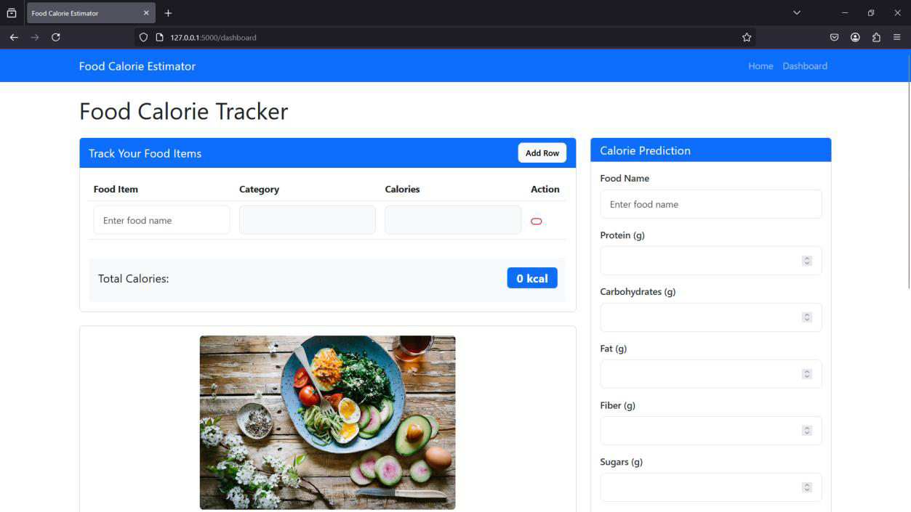
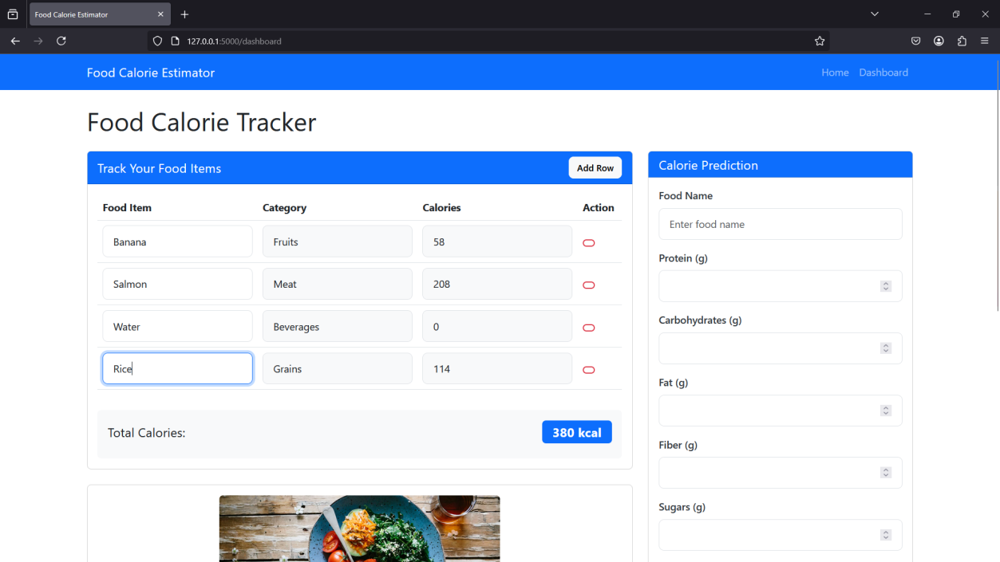
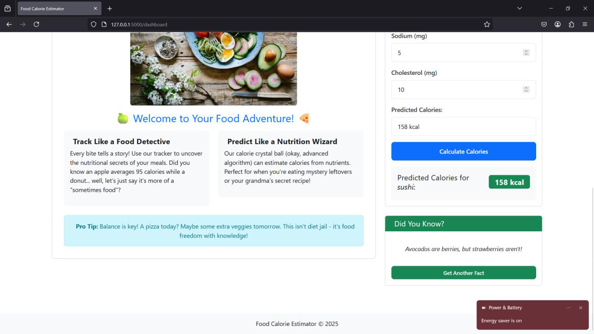
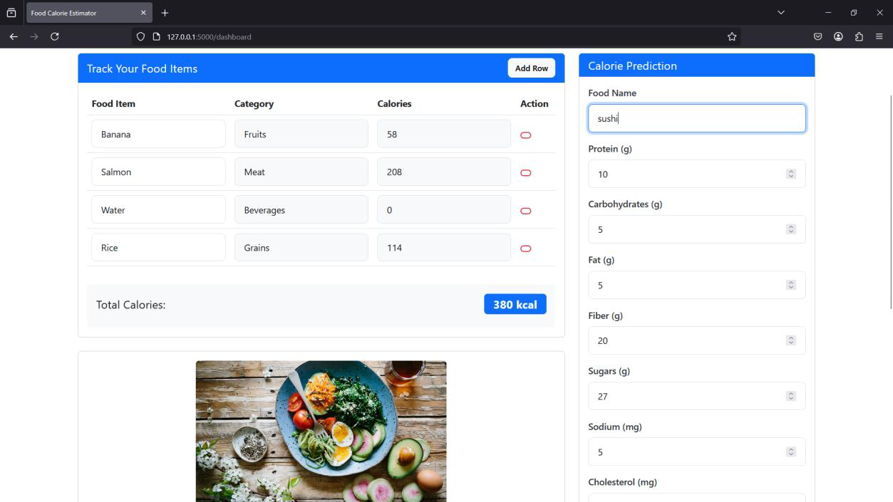

# Calories Tracker Application

A web application for tracking food intake and calories using machine learning for calorie prediction.

## Features

- User authentication (login/register)
- Food search with calorie prediction
- Food logging and tracking
- Dashboard with daily calorie summary

## Prerequisites

- Docker and Docker Compose
- Python 3.8+ (for local development)

## Setup

1. Clone the repository:
```bash
git clone <repository-url>
cd Calories

## Project Screenshots

### 🖼️ Layout Overview


### 🧪 Inputting New Data


### 📊 Results After Entering New Data


### ➕ New Data Loaded View

